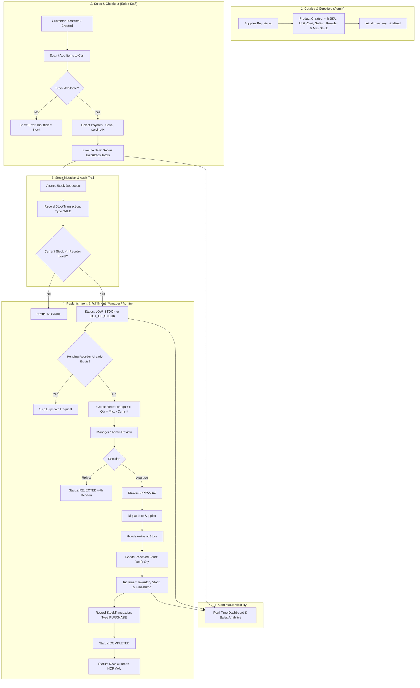

# Business Process & Workflow Architecture

The core philosophy of **Retail Store Manager** is that retail operations form a continuous, closed-loop cycle rather than disconnected CRUD tables. 

Every sale triggers inventory consequences; inventory changes drive replenishment signals; supplier deliveries feed back into saleable stock.

---

## 1. End-to-End Business Flow Diagram

---

## 2. Phase-by-Phase Process Walkthrough

### Phase 1: Product & Supplier Onboarding
- **Actors**: `ADMIN`
1. Admin creates a Supplier record (`name`, `contactPerson`, `email`, `phone`, `address`).
2. Admin registers a Product, linking it to the supplier and configuring vital inventory thresholds:
   - `costPrice` & `sellingPrice`
   - `reorderLevel` (e.g. 10 units)
   - `maximumStock` (e.g. 50 units)
   - `unit` (e.g. `pcs`, `kg`, `liters`, `box`)
3. The system automatically initializes the corresponding `Inventory` document with initial stock and audit transaction.

### Phase 2: Customer Engagement & Point of Sale (POS)
- **Actors**: `SALES_STAFF` or `MANAGER`
1. Cashier logs in and opens the POS terminal.
2. Cashier selects or registers a Customer (searchable by phone number or name). Walk-in guest customer is supported.
3. Cashier adds items to cart via instant search/barcode scan:
   - System presents live stock indicators.
   - If stock is 0, item is visually marked out of stock and cannot be added.
4. Cashier adjusts line-item quantities or specifies an optional overall discount.
5. Cashier selects tender method (`CASH`, `CARD`, `UPI`) and hits **Complete Sale**.

### Phase 3: Server-Side Atomic Execution & Audit Trail
- **Actors**: Backend System Engine
1. The server intercepts the payload:
   - Disregards frontend totals to prevent price manipulation.
   - Verifies product existence, active status, and real-time inventory levels.
2. **Concurrency-Safe Decrement**:
   - Executes an atomic update with query condition `{ currentStock: { $gte: requestedQty } }`.
   - If stock fell below required level during customer checkout, the sale safely aborts with HTTP 400 without partial commits.
3. System creates the `Sale` and `SaleItem` records.
4. System appends a `StockTransaction` audit entry:
   - `transactionType`: `SALE`
   - `quantity`: `-requestedQty`
   - `previousStock`: stock before sale
   - `newStock`: stock after sale
   - `referenceId`: `saleNumber`
   - `referenceType`: `Sale`
   - `performedBy`: Cashier `User` ID

### Phase 4: Stock Level Evaluation & Automated Reorder Trigger
- **Actors**: Inventory Engine
1. For each item sold, the new `currentStock` is compared against `reorderLevel`:
   - If `currentStock === 0` -> Inventory status becomes `OUT_OF_STOCK`.
   - If `currentStock <= reorderLevel` -> Inventory status becomes `LOW_STOCK`.
   - Otherwise -> Status remains `NORMAL`.
2. When low stock is detected, the engine executes the **Reorder Evaluation Rule**:
   - Queries if there is an unresolved `PENDING` reorder request for this product.
   - If **No**: Calculates recommended quantity:
     $$\text{Recommended Quantity} = \text{maximumStock} - \text{currentStock}$$
   - Generates a new `ReorderRequest` in `PENDING` status with unique human-readable number (e.g., `ORD-20260925-001`).
   - If **Yes**: Skips duplicate creation to avoid over-ordering.

### Phase 5: Manager Review & Supplier Approval
- **Actors**: `MANAGER` or `ADMIN`
1. Manager inspects the **Reorders** dashboard displaying all pending requisitions with current stock, reorder level, and supplier details.
2. Manager can:
   - **Approve**: Flags requisition as `APPROVED` with approval timestamp and manager ID.
   - **Reject**: Requires a mandatory justification reason (e.g., "Supplier out of stock", "Alternative product planned") and sets status to `REJECTED`. Stock is unaffected.

### Phase 6: Goods Inward Receipt & Replenishment
- **Actors**: `MANAGER` or `ADMIN`
1. When supplier delivers shipment, Manager opens the approved reorder and clicks **Receive Goods**.
2. Manager enters `receivedQuantity` (must be $> 0$).
3. System executes replenishment:
   - Increments inventory `currentStock` by `receivedQuantity`.
   - Updates `lastRestockedAt` timestamp to current time.
   - Recalculates inventory health (`NORMAL` if stock now exceeds `reorderLevel`).
   - Marks the reorder request status as `COMPLETED`.
   - Logs an audit `StockTransaction` of type `PURCHASE` referencing the order number.

### Phase 7: Real-Time Intelligence & Financial Reporting
- **Actors**: `ADMIN` and `MANAGER`
1. **Executive Dashboard**: Displays real-time sales revenue, inventory health breakdown, top-moving items, and urgent attention alerts.
2. **Sales Reports**: Tracks daily/weekly/monthly revenue, transaction volume, discounts, and payment method share.
3. **Stock Movement Ledger**: Complete unalterable audit log tracing every unit delta across all products.
