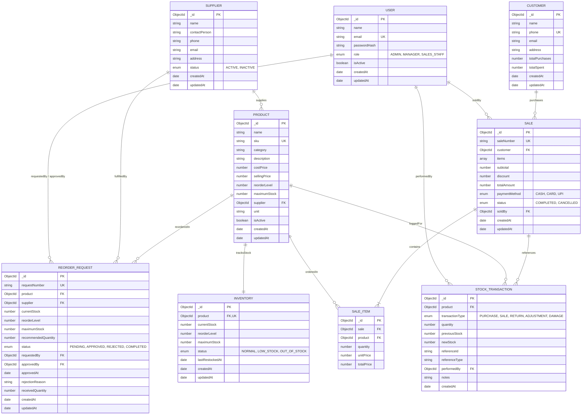

# Database Architecture & Entity Relationship Design

The database layer is built on MongoDB using Mongoose ODM. It maintains a clean normalized structure for relational integrity while leveraging document embedding where atomic reads provide performance advantages.

---

## 1. Entity-Relationship Diagram (ERD)

---

## 2. Collection Specifications & Data Dictionaries

### 2.1 Users Collection (`users`)
| Field | Type | Constraints / Attributes | Description |
|---|---|---|---|
| `_id` | ObjectId | Auto-generated PK | Unique identifier |
| `name` | String | Required, Trimmed | Full user name |
| `email` | String | Required, Unique, Lowercase, Trimmed | Login identifier |
| `passwordHash` | String | Required, Select: false | Bcrypt hashed password |
| `role` | String | Required, Enum: `['ADMIN', 'MANAGER', 'SALES_STAFF']` | Access privilege level |
| `isActive` | Boolean | Default: `true` | Account active flag |
| `timestamps` | Date | `createdAt`, `updatedAt` | Audit timestamps |

- **Indexes**: `{ email: 1 }` (Unique).

### 2.2 Suppliers Collection (`suppliers`)
| Field | Type | Constraints / Attributes | Description |
|---|---|---|---|
| `_id` | ObjectId | Auto-generated PK | Unique identifier |
| `name` | String | Required, Trimmed | Supplier company / vendor name |
| `contactPerson`| String | Required, Trimmed | Representative name |
| `phone` | String | Required, Trimmed | Contact telephone |
| `email` | String | Required, Lowercase | Contact email |
| `address` | String | Optional | Postal/warehouse address |
| `status` | String | Required, Enum: `['ACTIVE', 'INACTIVE']`, Default: `'ACTIVE'` | Vendor active status |
| `timestamps` | Date | `createdAt`, `updatedAt` | Audit timestamps |

- **Indexes**: `{ name: 1 }`, `{ status: 1 }`.

### 2.3 Products Collection (`products`)
| Field | Type | Constraints / Attributes | Description |
|---|---|---|---|
| `_id` | ObjectId | Auto-generated PK | Unique identifier |
| `name` | String | Required, Trimmed | Product trade name |
| `sku` | String | Required, Unique, Uppercase, Trimmed | Stock Keeping Unit |
| `category` | String | Required, Trimmed | Product grouping (Groceries, Dairy, etc.) |
| `description` | String | Optional | Product details |
| `costPrice` | Number | Required, Min: 0 | Purchase wholesale price |
| `sellingPrice` | Number | Required, Min: 0 | Retail price to customer |
| `reorderLevel` | Number | Required, Min: 0 | Minimum threshold before reordering |
| `maximumStock` | Number | Required, Min: reorderLevel + 1 | Optimal ceiling storage quantity |
| `supplier` | ObjectId | Required, Ref: `'Supplier'` | Primary vendor |
| `unit` | String | Required, Default: `'pcs'` | Measuring unit (`pcs`, `kg`, `liters`, etc.) |
| `isActive` | Boolean | Default: `true` | Catalog visibility |
| `timestamps` | Date | `createdAt`, `updatedAt` | Audit timestamps |

- **Indexes**: `{ sku: 1 }` (Unique), `{ category: 1 }`, `{ isActive: 1 }`.

### 2.4 Inventory Collection (`inventories`)
| Field | Type | Constraints / Attributes | Description |
|---|---|---|---|
| `_id` | ObjectId | Auto-generated PK | Unique identifier |
| `product` | ObjectId | Required, Unique, Ref: `'Product'` | Linked product |
| `currentStock` | Number | Required, Min: 0, Default: 0 | Real-time on-hand units |
| `reorderLevel` | Number | Required, Min: 0 | Cached reorder threshold |
| `maximumStock` | Number | Required, Min: 1 | Cached ceiling threshold |
| `status` | String | Required, Enum: `['NORMAL', 'LOW_STOCK', 'OUT_OF_STOCK']` | Computed health flag |
| `lastRestockedAt`| Date | Default: null | Timestamp of most recent goods arrival |
| `timestamps` | Date | `createdAt`, `updatedAt` | Audit timestamps |

- **Indexes**: `{ product: 1 }` (Unique), `{ status: 1 }`, `{ currentStock: 1 }`.

### 2.5 Customers Collection (`customers`)
| Field | Type | Constraints / Attributes | Description |
|---|---|---|---|
| `_id` | ObjectId | Auto-generated PK | Unique identifier |
| `name` | String | Required, Trimmed | Customer full name |
| `phone` | String | Required, Unique, Trimmed | Phone number (search key) |
| `email` | String | Optional, Lowercase, Trimmed | Customer email |
| `address` | String | Optional | Customer street address |
| `totalPurchases`| Number| Default: 0 | Cumulative number of orders |
| `totalSpent` | Number | Default: 0 | Cumulative currency spent |
| `timestamps` | Date | `createdAt`, `updatedAt` | Audit timestamps |

- **Indexes**: `{ phone: 1 }` (Unique), `{ name: 1 }`.

### 2.6 Sales Collection (`sales`)
| Field | Type | Constraints / Attributes | Description |
|---|---|---|---|
| `_id` | ObjectId | Auto-generated PK | Unique identifier |
| `saleNumber` | String | Required, Unique | Formatted number (`SALE-YYYYMMDD-XXXX`) |
| `customer` | ObjectId | Optional, Ref: `'Customer'` | Customer (nullable for walk-in cash) |
| `items` | Array | Ref: `'SaleItem'` or Embedded Item objects | Line items breakdown |
| `subtotal` | Number | Required, Min: 0 | Sum of line totals before discount |
| `discount` | Number | Required, Min: 0, Default: 0 | Applied discount |
| `totalAmount` | Number | Required, Min: 0 | Subtotal minus discount |
| `paymentMethod`| String | Required, Enum: `['CASH', 'CARD', 'UPI']` | Method of payment |
| `status` | String | Required, Enum: `['COMPLETED', 'CANCELLED']` | Sale execution status |
| `soldBy` | ObjectId | Required, Ref: `'User'` | Cashier user reference |
| `timestamps` | Date | `createdAt`, `updatedAt` | Audit timestamps |

- **Indexes**: `{ saleNumber: 1 }` (Unique), `{ createdAt: -1 }`, `{ soldBy: 1 }`, `{ customer: 1 }`.

### 2.7 Sale Items Collection (`saleitems`)
| Field | Type | Constraints / Attributes | Description |
|---|---|---|---|
| `_id` | ObjectId | Auto-generated PK | Unique identifier |
| `sale` | ObjectId | Required, Ref: `'Sale'` | Parent sale transaction |
| `product` | ObjectId | Required, Ref: `'Product'` | Sold product |
| `quantity` | Number | Required, Min: 1 | Quantity purchased |
| `unitPrice` | Number | Required, Min: 0 | Product selling price at time of sale |
| `totalPrice` | Number | Required, Min: 0 | Calculated `quantity * unitPrice` |

- **Indexes**: `{ sale: 1 }`, `{ product: 1 }`.

### 2.8 Stock Transactions Collection (`stocktransactions`)
| Field | Type | Constraints / Attributes | Description |
|---|---|---|---|
| `_id` | ObjectId | Auto-generated PK | Unique identifier |
| `product` | ObjectId | Required, Ref: `'Product'` | Affected product |
| `transactionType` | String | Required, Enum: `['PURCHASE', 'SALE', 'RETURN', 'ADJUSTMENT', 'DAMAGE']` | Action category |
| `quantity` | Number | Required | Signed unit delta (+ for IN, - for OUT) |
| `previousStock`| Number | Required, Min: 0 | Balance before mutation |
| `newStock` | Number | Required, Min: 0 | Balance after mutation |
| `referenceId` | String | Optional | Sale #, Order #, or adjustment code |
| `referenceType` | String | Optional | Type of referenced document |
| `performedBy` | ObjectId | Required, Ref: `'User'` | Staff member executing action |
| `notes` | String | Optional | Rationale or comment |
| `createdAt` | Date | Immutable | Event timestamp |

- **Indexes**: `{ product: 1, createdAt: -1 }`, `{ transactionType: 1 }`, `{ referenceId: 1 }`.

### 2.9 Reorder Requests Collection (`reorderrequests`)
| Field | Type | Constraints / Attributes | Description |
|---|---|---|---|
| `_id` | ObjectId | Auto-generated PK | Unique identifier |
| `requestNumber`| String | Required, Unique | Formatted number (`ORD-YYYYMMDD-XXXX`) |
| `product` | ObjectId | Required, Ref: `'Product'` | Reordered item |
| `supplier` | ObjectId | Required, Ref: `'Supplier'` | Target vendor |
| `currentStock` | Number | Required, Min: 0 | Snapshot stock at request creation |
| `reorderLevel` | Number | Required, Min: 0 | Snapshot reorder threshold |
| `maximumStock` | Number | Required | Snapshot ceiling threshold |
| `recommendedQuantity` | Number | Required, Min: 1 | Calculated: `maximumStock - currentStock` |
| `status` | String | Required, Enum: `['PENDING', 'APPROVED', 'REJECTED', 'COMPLETED']` | Request lifecycle |
| `requestedBy` | ObjectId | Optional, Ref: `'User'` | Requesting user or System |
| `approvedBy` | ObjectId | Optional, Ref: `'User'` | Approving Manager/Admin |
| `approvedAt` | Date | Optional | Timestamp of approval/rejection |
| `rejectionReason` | String| Optional | Mandatory if `status === 'REJECTED'` |
| `receivedQuantity`| Number| Min: 0, Default: 0 | Units physically received in shipment |
| `timestamps` | Date | `createdAt`, `updatedAt` | Lifecycle timestamps |

- **Indexes**: `{ requestNumber: 1 }` (Unique), `{ product: 1, status: 1 }`, `{ status: 1 }`.
